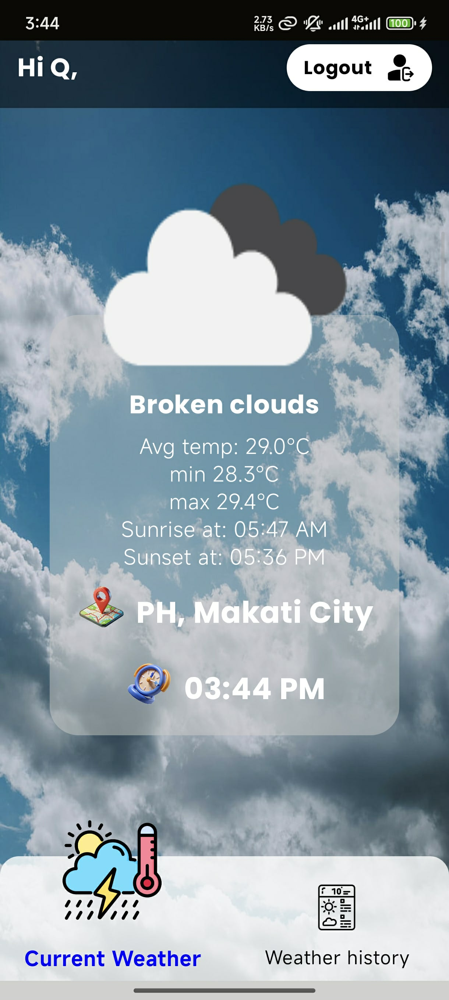
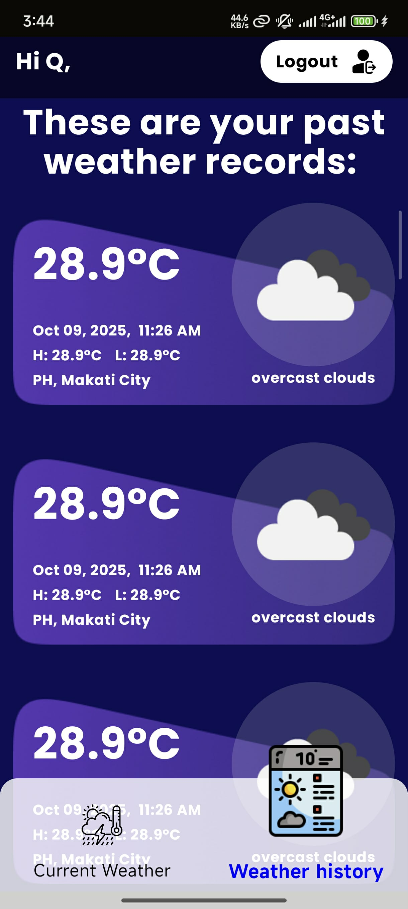
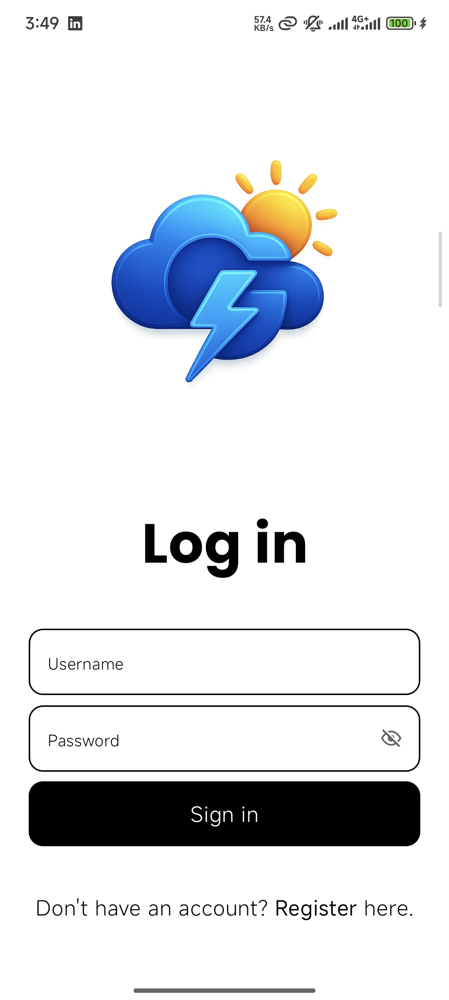
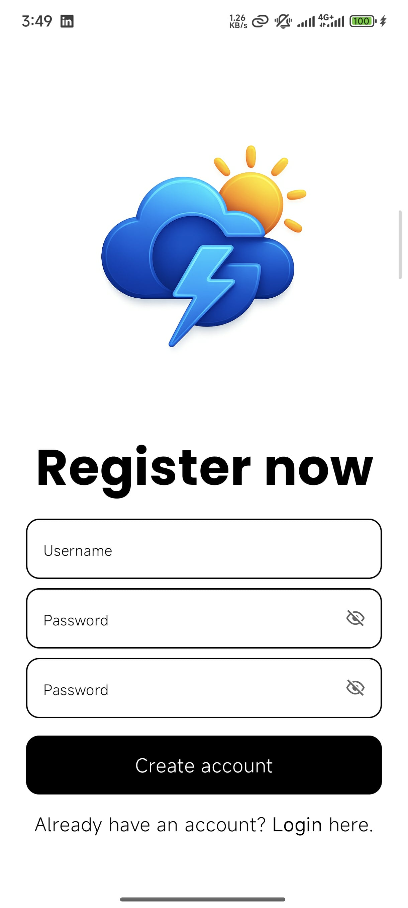
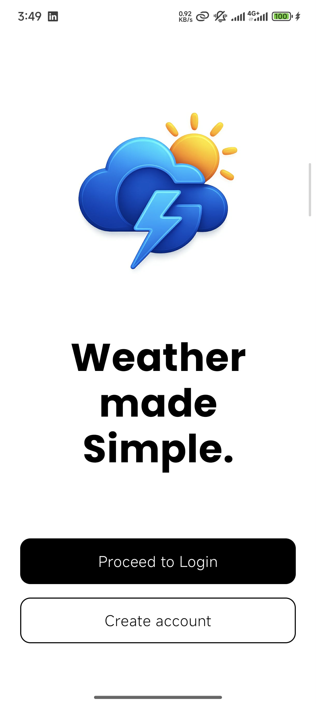

GWeather app - Ian Lipa

GWeather is a modern and user-friendly weather tracking application that connects to the OpenWeather
API to deliver accurate, real-time weather updates. It provides users with both current weather
information and a historical list of weather data collected every time the app is opened.

🚀 Key Features
🧑‍💻 User Authentication

**Registration and Sign-In System**:

- Users can create an account and securely sign in to personalize their weather experience.
- All authentication processes are handled through a secure local backend with proper validation and
  password encryption.
  **Bonus feature
  Every registered user has its own password encryption key that is generated during registration
  and is saved locally using SharedPreference giving additional layer of security
  (see implementation: SecurePreference.class)
- User can logout and sign in as a new user

The first tab of the application and displays the latest/current weather information based on the
user’s current location.

It includes:

**City and Country**: Automatically detected via the user’s geolocation.
**Current Temperature**: Displayed in Celsius, fetched directly from the OpenWeather API.
**Sunrise and Sunset Time**: Clearly shown in the user’s local time zone.
**Dynamic Weather Icon**: Displays a dynamic Icon depending on the Icon provided by the OpenWeather
Api. -- no day or night icon indicator for cloudy weather
**Dynamic Weather Background**: Displays a dynamic background on the first tab(Current weather)
depending on the
weather detected. -- all weather data is refreshed in real time whenever the user opens the app.
**Time of data collection**: Displays the exact time when the weather data is collected

📜 Weather History Tab
The second tab shows a list of all previously fetched weather data each time the app was opened.

This includes:
Date and Time of Fetch
City and Country
Temperature (°C)
Weather Description (e.g., Clear, Rainy, Cloudy)
Corresponding Weather Icon
Time of data collection

This provides a convenient way for users to track weather changes over time.
-- Weather data collected on the fist tab is only displayed on this tab after fetching new weather data

⚙️ Technical Details
API Used: OpenWeather API
===============================================================================================
Note: Before running the app, you need to create/add a field in local.properties named
'OPEN_WEATHER_API_KEY' where you will put the api key. This implementation to secure api key in
safe place not visible in the repo.
===============================================================================================

Libraries/Technologies/Concept used:

- Retrofit
- MVVM pattern
- Clean code
- Hilt Dagger(DI)
- SecurePreference/SharedPreference
- BCrypt(Encryption/Decryption)
- Coroutines
- RoomDB
- Jetpack Compose

All resources used come from the general internet and some AI generated(GWeather logo)💡

Here are preview of the pages

